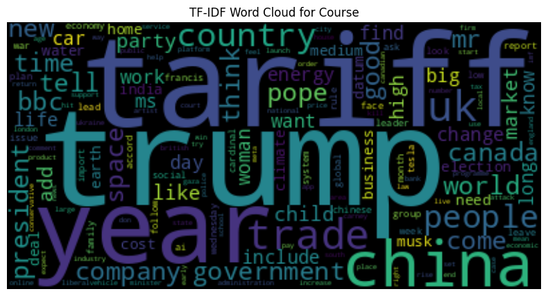

# Project Proposal: Interactive Dashboard for Trump-Related News Sentiment and Market Analysis

## High-Level Goal
We aim to develop an interactive dashboard that visualizes the positive and negative sentiment of Trump-related news across countries and key policy topics, alongside corresponding financial market impacts through stock price and currency exchange rate trend analyses. Specifically, we want to investigate how media coverage of Trump’s policies, especially around trade and tariffs, can influence public sentiment and market behavior.

## Goal Description
We want to build an interactive dashboard that brings together two seemingly disparate but deeply intertwined dimensions of contemporary political discourse: how the global media perceives and reacts to Trump-related policies, and how those perceptions correlate with real-time movements in financial markets. Our motivation stems from a preliminary analysis indicating that Trump-related news, especially concerning tariffs and trade policies, significantly impacts both public sentiment and financial markets. 

By scraping and sentiment-scoring a corpus of BBC articles mentioning Trump, and then mapping average positivity and negativity across countries and policy themes (such as trade, tariffs, finance, and technology), the dashboard will allow users to immediately see which regions and topics provoke the strongest reactions. At the same time, integrating stock price time series for major indices or key sector ETFs will let us explore whether surges in media optimism or pessimism align with market rallies or sell-offs.

This project combines three key elements into one dashboard—news sentiment, interactive maps, and market charts—eliminating the need to jump between multiple apps. It helps anyone from policy analysts to reporters quickly see how people feel about a policy, and at the same time gives investors a clear view of how markets are reacting.

For example, users could ask, “Did negative headlines about tariffs in Asia align with a sell-off in export stocks?” and view both the sentiment curve and the stock chart side by side. In just a few clicks, they would be able to see a real-world story where public mood meets price action, providing immediate insights into the relationship between news sentiment and market movements.

## Data Collection
- **Main dataset**: We begin by collecting news articles from BBC, focusing on those mentioning Trump-related policies. The data spans from August 2024 to April 2025. This dataset is scraped daily to gather articles, which are then processed for sentiment analysis and topic modeling.
- **External dataset**: For the same timeframe, we gather stock market data and currency exchange rate data from Yahoo Finance. Company names and currency pairs are sourced from Nasdaq and Xe.com, respectively. The stock data includes major indices and key sector ETFs, while the currency data covers 194 exchange rates.

We conducted a quick data cleaning and exploratory data analysis (EDA). The word cloud highlights significant words such as "Trump," "tariff," "China," "trade," and "president.", as follows:

## Data Visualization Plan
Our motivation stems from a preliminary analysis indicating that Trump-related news, especially concerning tariffs and trade policies, significantly impacts both public sentiment and financial markets. 

By scraping and sentiment-scoring a corpus of BBC articles mentioning Trump, and then mapping average positivity and negativity across countries and policy themes (e.g. trade, tariffs, finance, technology), audiences can immediately see which regions and topics provoke the strongest reactions. At the same time, integrating stock-price time series for major indices or key sector ETFs lets us explore whether surges in media optimism or pessimism line up with market rallies or sell-offs.

This project brings together news sentiment, interactive maps, and market charts into a single dashboard, making it easy for users to analyze sentiment and market reactions simultaneously. For example, you can ask, “Did negative headlines about tariffs in Asia line up with a sell-off in export stocks?” and view both the sentiment curve and the stock chart side by side. This provides a clear and accessible real-world story of how public mood meets price action.

## Weekly Plan

| Week | Dates               | Task                              | Hiếu’s Responsibilities                     | Huyền’s Responsibilities              |
|------|---------------------|-----------------------------------|--------------------------------------------|--------------------------------------|
| Week 1 | Apr 28 – May 4, 2025 | Data Crawling                     | • Implement BBC news scraper               | • Build financial-market API crawler |
|      |                     |                                   | • Schedule nightly runs                   | • Store raw CSV outputs              |
| Week 2 | May 5 – May 11, 2025 | Data Cleaning & Preprocessing      | • Clean and tokenize article text         | • Normalize financial time series    |
|      |                     |                                   | • Remove stopwords, normalize dates       | • Merge news & market tables by date |
| Week 3 | May 12 – May 18, 2025 | Data Analysis & Visualization Draft | • Sentiment & topic modeling pipeline      | • Geospatial mapping & choropleth    |
|      |                     |                                   | • Compute country-level aggregates        | • Market correlation charts          |
| Week 4 | May 19 – May 25, 2025 | Dashboard, Report & Slides         | • Develop interactive dashboard (Plotly/Shiny) | • Write final report sections        |
|      |                     |                                   | • Integrate all viz modules               | • Design presentation slides         |

## GitHub Repository
- [Project GitHub Repository](https://github.com/Ctn3m0/Group1_Project2_Data_Viz/tree/main)

